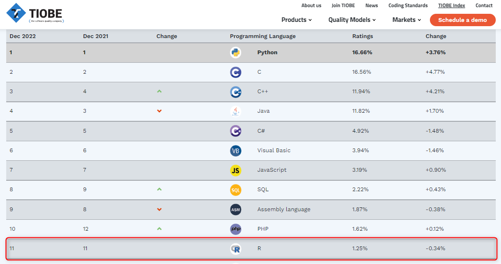
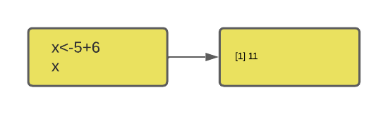
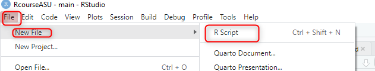
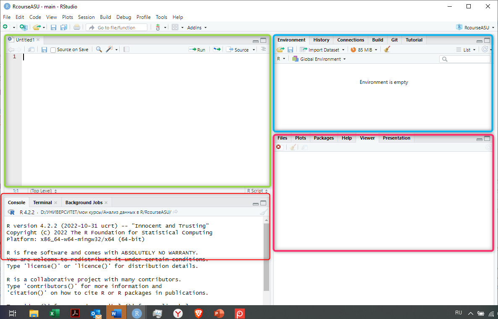
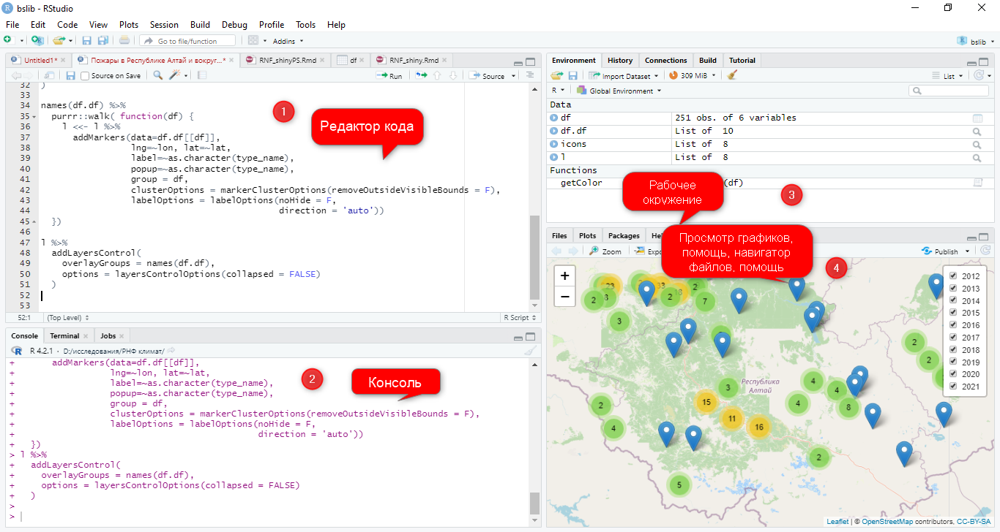
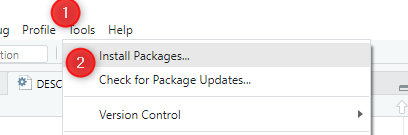
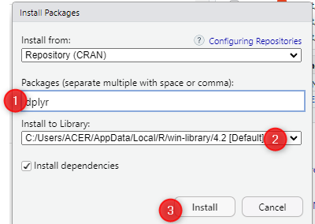

```{r setup, include=FALSE}
library(learnr)
knitr::opts_chunk$set(echo = FALSE)
```

## Что такое R?

R – это язык программирования и свободная программная среда для статистической обработки и визуализации данных.

Несмотря на наличие огромного количества языков программирования и различных программ для статистической обработки данных, R в течение двух десятилетий остается популярным языком и средой обработки и анализа данных для специалистов из разных областей знания.

Позиции языка R среди других языков программирования довольно высоки. Так, по данным индекса Tiobe за 2021 год, R занимает 12-е место в мире:



Однако, прежде всего, это язык, который используют ученые и управленцы для анализа реальных данных и разработки научно обоснованных систем принятия решений, поэтому место в общем рейтинге не так высоко. Если посмотреть сферы использования, то на первом месте - академическая среда, на втором - сфера здравоохранения, на третьем - правительственные учреждения.  

{width=80%}


R используют банки и маркетинговые агентства, технические компании и информационные гиганты для разных целей - от обработки данных до прогнозирования и представления интерактивной инфографики.

Вот только небольшой список тех компаний, которые используют R в своей деятельности. 


## Каковы преимущества R?

Их довольно много:

1. Возможности для **статистической обработки**, от простых функций до сложных моделей. 

Почти все новое, что появляется в области статистики, можно найти в одной из библиотек R. Например, ANZ банк использует R для моделирования невыплат по ипотечному кредитованию, а The Bank Of America применяет R для формирования финансовой отчетности

2. Это язык программирования **с открытым исходным кодом** (Open-source)

Что это значит? Это значит, что, во-первых, все написанное на R открыто для изучения и критики, а, во-вторых, каждый может внести вклад в его развитие и улучшение путем создания новых библиотек и новых функций для решения различных задач.

3. **Поддержка сообщества** (Community)

У R - более 2 миллионов пользователей по всему миру, сообщество пользователей R не только внушительное по размеру, но и очень активное. Каким бы ни был ваш проект - учебным или крупномасштабным, всегда найдется тот, кто поможет разобраться в коде и принять правильное решение. Вы тоже можете найти себе единомышленников и подключаться к другим проектам.

Некоторые полезные ссылки:

- https://community.rstudio.com/
- https://www.r-bloggers.com/
- https://stackoverflow.com/questions/tagged/r
- https://rweekly.org/
 https://www.reddit.com/r/Rlanguage/
- https://r.awesome-programming.com/en/awesome/r-language-02/community

Специально для девушек (сообщество созанно для обеспечения гендерного равенства среди разработчиков и поддержки женщин в сообществе пользователей R):
https://rladies.org/


4. Огромная **коллекция библиотек и полезных функций**, позволяющих расширить возможности базового языка

Самые авторитетные хранятся в CRAN (Comprehensive R Archive Network), их более 10 тысяч, однако, каждый может создать свою библиотеку и разместить ее, например, на [github](https://github.com/search?q=R) для тестирования и доработки. 


Примеры библиотек:

- для обработки данных и всевозможных манипуляций с ними (`dplyr`, `tidyr`)
- работа с большими данными (`sparklyr`)
- глубокое обучение (`keras`, `TensorFlow`)
- машинное обучение (`H2O`)
- визуализация данных (`ggplot2`)
- создание отчетов, итерактивная графика и обучение (`Rmarkdown`, `shiny`).

5. **Совместимость с другими языками программирования**

Большинство функций и библиотек написаны на самом языке R. Однако, для сложных вычислительных задач, могут использоваться и другие языки, такие как C, C++, FORTRAN. Для манипуляций с объектами, возможно использование других языков - .NET, Java, Python. Иными словами, возможности программирования становятся практически безграничными.

6. Создание привлекательных **визуализаций**

В современном мире анализ данных невозможен без качественной визуализации, особенно если его результаты планируется использовать в сфере политики и бизнеса. 
R является одним из лучших инструментов для создания качественной графики, и такие библиотеки как `ggplot2`, `plotly`, `ggvis` помогут создать очень детализированные и привлекательные визуализации.


7. **Интеграция с Hadoop и анализ больших данных**

Если перед вами стоит задача анализа больших данных, то с такими библиотеками как `rmr`, `rhdfs`, `rhbase`, `RHIVE`, `RHIPE` и `Rhadoop` возможно интегрировать R и  Hadoop (проект фонда Apache Software Foundation для разработки и выполнения распределённых вычислений для работы с большими данными).

Возможности по хранению данных Hadoop и вычислительные достоинства R используют многие в качестве оптимального решения для анализа больших данных. Например, компания Форд использует R и Hadoop для обработки данных обратной связи с потребителями, что позволяет им улучшить дизайн и обосновывать бизнес решения.


8. Создание **интерактивных веб-приложений**

С помощью R и библиотеки shiny можно создавать интерактивные приложения, с помощью которых пользователи (ученики, заказчики, журналисты и пр.) могут познакомиться с вашими данными, провести какие-то виды анализа, сделать визуализацию, возможно изучить какие-то закономерности (часто используются как обучающий инструмент). Эти приложения можно хранить на сервере Shiny или в другом доступном месте.


Примеры:

- https://shiny.rstudio.com/gallery/covid19-tracker.html
- https://shiny.rstudio.com/gallery/fifa-births.html
- https://shiny.rstudio.com/gallery/india-blood-banks.html

9. **Совместимость с другими платформами**

R может работать с любой конфигурацией оборудования и поддерживает различные операционные системы, независимо от окружения выдает предсказуемые и однозначные результаты.

10. Возможность запуска кода **без компилирования**

R относится к интерпретируемым языкам, что означает, что ему не требуется компилятор для того, чтобы программа заработала. Иными словами, все команды, которые мы вводим, сразу же выполняются, без дополнительного компилирования (сборки), как в других языках.




Кроме этих преимуществ есть и много других, о которых мы узнаем в процессе изучения курса.

{width=50%}

### Вопросы для самопроверки 

```{r, include=FALSE}
library(learnr)
tutorial_options(exercise.cap = "Sandbox")
```

```{r quiz1}
quiz(
  question("Каким языком является R?",
    answer("компилируемым"),
    answer("процедурным"),
    answer("интерпретируемым", correct = TRUE),
    answer("структурным"),
  allow_retry = TRUE
  ),
  question("Может ли R быть интегрирована с Hadoop для обработки больших данных?",
    answer("да", correct = TRUE),
    answer("нет"),
  allow_retry = TRUE
  )
)
```

## Немного истории

R был создан профессорами **Россом Ихака** и **Робертом Джентельменом** (Ross Ihaka и Robert Gentleman) в 1992 году, сначала как язык программирования для обучения студентов статистике в университете Окленда (Новая Зеландия). Авторы вдохновлялись при создании языком S, используемым в лаборатории Bell, и ради шутки назвали язык R - по первым буквам собственных имен. 

В июне 1995 года, статистик **Мартин Махлер** убедил Ихаку и Джентельмена опубликовать R как язык со свободным исходным кодом под публичной лицензией GNU. Первая официальная версия была выпущена 29 февраля 2000 года. 

Чуть ранее, в 1997 году **Куртом Хорником** и **Фрицем Лейшем** была основана Сеть для архивирования кода R (CRAN, The Comprehensive R Archive Network), цель которой заключалась в хранении исходного кода, выполняемых файлов, документации и библиотек, создаваемых пользователями. На момент декабря 2022 года CRAN имел 103 зеркальных сервера и 18 976 библиотек.

Команда разработчиков (R Core Team) также была основана в 1997 году для дальнейшего развития языка. Сейчас в ней состоят ведующие разработчики, статистики, специалисты по компьютерным наукам, всего более 20 человек. В апреле 2003 года для развития проекта была создана некоммерческая организация R Foundation. Цель фонда заключается в предоставлении технической поддержки и коммуникации с создателями R, хранении и управлении технической документацией и интеллектуальной собственностью.

Создатели R:

**Роберт Джентельмен**

 

**Росс Ихака**:


### Кое-что еще о разработчиках R

Кроме основной команды, в сообществе R выделяются талантливые программисты, которые разрабатывают библиотеки, без преувеличения производящие революцию в обработке и анализе данных. Это настоящие гуру, которых очень уважают в исследовательском сообществе, их имена знают все, кто работает в R. Ну, или почти все...

ТОП-3 (по моему личному мнению)

1. **Хэдли Уикхэм** (Hadley Wickham) - программист из Новой Зеландии, главный научный сотрудник в компании RStudio. Без преувеличения самый известнй, очень трудолюбивый и плодотворный разработчик R, автор почти 100 (!) библиотек, в том числе таких мегапопулярных как `ggplot`, `dplyr`, `tidyverse`, `devtools` и других. Этими библиотеками воспользовались более 825 тыс. человек.

{width=30%}


2. **Дирк Эддельбуэттель** (Dirk Eddelbuettel) - канадский ученый в области статистики, программист и исследователь, второй в нашем списке лучших разработчиков библиотек для R. Принял участие в создании более 60 библиотек, наиболее популярными среди которых является `Rcpp`, позволяющая интегрировать R с другим не менее популярным языком C++, а также `RPostgreSQL`, предоставляющая интерфейс для работы с системой баз данных PostgreSQL. Работает в Иллинойском университете в Урбане-Шампейне.

{width="300"}

3. **Ихуэй Се** (Yihui Xie) - еще один плодовитый разрботчик, создавший более 40 библиотек, загруженных более 130 тыс. раз. Его большая заслуга в том, что разработал инструменты для создания интерактивных приложений (`knitr`, `rmarkdown`, `shiny` и `htmlwidgets` - его детища, и мы тоже с ними познакомимся на следующих занятиях). Yihui Xie также поддерживает систему `bookdown`, которую можно использовать для написания книг и отчетных документов с помощью R Markdown. Инженер-программист компании RStudio.


### Вопросы для самопроверки

```{r quiz2}
quiz(
  question("На основе какого языка создан R?",
    answer("Python"),
    answer("Oracle"),
    answer("S", correct = TRUE),
    answer("Java"), 
  allow_retry = TRUE
  ),
  question("Страна, в которой был создан R?",
    answer("Новая Зеландия", correct = TRUE),
    answer("Австралия"),
    answer("США"),
    answer("Канада"), 
  allow_retry = TRUE
  )
)
```
## Установка R и RStudio

Прежде, чем начать работать с R нам нужно установить его себе на компьютер. Для этого необходимо перейти по ссылке и выбрать версию, подходящую для вашей операционной системы (ссылка ниже ведет на версию для Windows):
https://cran.r-project.org/bin/windows/base/

Вместе с R устанавливается небольшая консоль, в которой можно набирать команды на R, но работать в ней не очень удобно, поэтому большинство пользователей предпочитает работать со специальным интерфейсом, или интегрированной средой разработки. Для языка R создано довольно много таких сред, однако, наиболее популярной является RStudio.

Это бесплатная программа, скачать которую можно по ссылке.

https://www.rstudio.com/products/rstudio/  


Эти шаги не очень трудны и не потребуют каких-то особых навыков, но на всякий случай, можно обратиться к однму из обучающих видео:

Как установить R:


Как установить RStudio:


В комьютерных классах устанавливать ничего не нужно, эти инструкции для домашнего использования.

## Начало работы в RStudio

После первого запуска RStudio вы, скорее всего, увидите вот такую картину:

{width=50%}

Основное окно RStudio будет состоять из трех частей (экранов).

Синим цветом обозначена консоль - здесь можно писать код, и здесь же будут появляться результаты его выполнения, а также различные сообщения, с помощью которых R "общается" с пользователями. 

Зеленый экран - рабочее окружение - здесь хранятся создаваемые и загружаемые объекты - данные (вектора, датафреймы и пр.), пользовательские функции и некоторые другие объекты. 

Красный экран - окно просмотра. В отдельных вкладках можно посмотреть, какие файлы и папки есть в рабочей директории, какие библиотеки установлены, можно запросить помощь или посмотреть графики (в процессе анализа).

Это только в первый раз окна всего три.

Выберите в меню File - New File - R Script:



Откроется новый файл, и окон станет четыре:

{width=80%}

В этом новом окне можно писать код и комментарии, сохранять его как отдельный файл с расширением .R, который можно запускать повторно, что очень удобно и позволяет значительно сохранить время при рутинной обработке данных. Очень часто в ходе обработки и анализа данных приходится осуществлять повторяющиеся действия, и скрипт поможет ускорить процесс обработки. В этом состоит основное отличие от консоли, где код можно запустить только однажды.


{width=50%}

## Как установить нужную библиотеку? 

Как мы выяснили, базовый язык R в настоящее время используется наряду с многочисленными функциями и библиотеками, разрабатываемыми коллективами ученых и разработчиками из разных стран мира, включая Россию. 

Устанавливать новые библиотеки нам придется практически на каждом занятии, поэтому лучше научиться делать это сразу.

Эти библиотеки хранятся в основном в двух местах:

- [CRAN](https://cran.r-project.org/)
- [Github](https://github.com/) - нечто вроде социальной сети для программистов, где все друг друга знают, создают совместные проекты и делятся кодом.

### Как установить библиотеку с помощью CRAN 

Чтобы скачать нужную библиотеку (конечно, нужно знать ее название, иначе ничего не получится) с помощью CRAN, проще всего воспользоваться меню RStudio:




Затем в окне **Packages** необходимо ввести имя нужной библиотеки и нажать на кнопку **Install**.



### Как установить библиотеку из Github

Не все библиотеки доступны на CRAN, так как эта процедура достаточно сложная и строгая, предполагает несколько проверок (кода, сопроводительной документации). Достаточно частая практика, когда библиотека еще не подана для регистрации на CRAN, разработчики помещают ее на GitHub, откуда ее можно скачать и использовать по назначению. Это позволяет разработчикам получить обратную связь, устранять возможные ошибки, улучшать код. 

#### Пара слов о библиотеке/пакетах, которые мы тут устанавливаем

Мы называем "библиотеку" "библиотекой" и подразумеваем под ней набор каких-то полезных утилит, потому что так принято в русскоязычном сегменте Интернета, посвященном программированию. 

Однако, по-английски библиотека называется **package**, то есть "пакет", в котором "упакованы" функции, сопровождающие документы и иногда готовые данные, а вот функция, которая этот пакет запускает - `library()` - то есть собственно библиотека, такие вот языковый казус. Об этом стоит помнить и слова эти не путать.

Чтобы установить нужную библиотеку из GitHub, нам понадобится функция `install_github()`, в которой мы должны указать имя разработчика и название библиотеки. Однако, чтобы выполнить эту функцию, нужна дополнительная библиотека `devtools`. Установить ее можно через CRAN с помощью описанного выше способа. А уже затем, загрузив ее, установить нужную нам библиотеку (получается сложновато, зато мы сразу научимся нужным действиям, потом мы доведем их до автоматизма):

```{r, echo=TRUE, eval=FALSE}
library (devtools)
install_github("DeveloperName/PackageName")

```

```{r checkbox, echo = FALSE}
question_checkbox(
  "Каким способом можно установить библиотеку в R",
  answer("CRAN", correct = TRUE),
  answer("GitHub", correct = TRUE),
  random_answer_order = TRUE,
  allow_retry = TRUE,
  try_again = "Нужно отметить все возможные варианты ответа"
)
```

## Первые простые действия в R

Синтаксис R очень прост, и мы овладеть его основами буквально за несколько действий.

Например, мы можем вводить в R какой-то текст - обязательно в кавычках или последовательность цифр, а также использовать R для простых арифметических действий.

Упражнение: напишите любое предложение в кавычках и запустите код.

```{r simple-phrase, exercise=TRUE}

```

Упражнение: напишите в окне пример 3+7 и запустите код.

```{r three-plus-seven, exercise=TRUE}

```

В отличие от многих языков, для того, чтобы вывести на экран введенные данные в R необязательно использовать функцию `print()`. Однако, эта функция есть и ее можно использовать:

```{r print, exercise=TRUE}
print("Привет, мир!")
```

Достаточно часто к коду прилагаются комментарии, чтобы сам разработчик или тот, кто будет использовать код в дальнейшем, знал, для чего нужны те или иные действия.

Как и во многих других языках, комментирование в R осуществляется с помощью знака #:

```{r comment, exercise=TRUE}
#Это комментарий
print("Привет, мир!")
```
