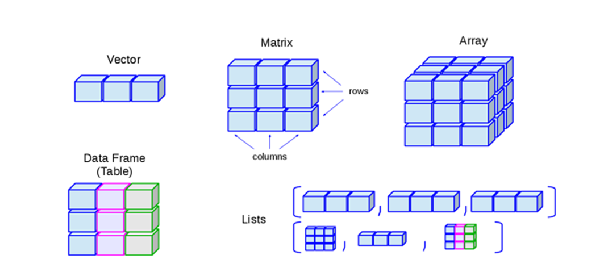

```{r setup, include=FALSE}
library(learnr)
knitr::opts_chunk$set(echo = FALSE)
gradethis::gradethis_setup()
```

## Основы синтаксиса R и некоторые базовые команды

Все естественные языки содержат некоторые правила, описывающие то, как язык должен быть использован, и позволяющие носителям языка понимать друг друга без проблем. 

В языках программирования, и в R, в частности, тоже есть такие правила, которые нужно соблюдать для того, чтобы компьютер понял, что от него требуется. В обычном языке правила иногда меняются или не соблюдаются, что не мешает людям понимать друг друга. С R, однако такой номер не пройдет, правила являются фиксированными, и требуется их неукоснительное соблюдение, чтобы не возникало ошибок.

Рассмотрим некоторые, самые базовые правила.

### Команды R 

Как большинство других языков программирования, R состоит из совокупности команд, формирующих последовательность инструкций, которые выполняет компьютер. Можно условно рассматривать такие команды в качестве глаголов, которые обозначают какие-то действия, которые выполняет R для получения определенного результата.

Например:
```{r hello3, exercise=TRUE}
print("Привет, мир!")

```

Эта команда выполняет вывод на экран сообщения. Код на R обычно содержит множество команд, и обычно, каждая команда распологается на своей строке. Примеры:

``` {r print, exercise=TRUE}
print("Сегодня хорошая погода")
print(1+1)
print(4 > 5)
```

Первая команда выводит сообщение, вторая - производит математические действия третья - оценивает истинность или ложность утверждения и выводит результат. 

Обычно каждая команда находится в своей строке, но можно их писать и в одну строку, разделяя точкой с запятой:

``` {r line, exercise=TRUE}
x <- 1+1; print(x); print(x^2)
```

В этом примере три команды приведены в одной строке. Первая команда создает переменную `x`, вторая выводит на экран значения этой переменной, третья - вычисляет квадрат значений переменной  `x` и выводит результат на экран. Точка с запятой используется в качестве знака окончания команды и подсказывает R, где заканчивается одна команда и начинается другая. Если строка содержит только одну команду, точку с запятой можно не ставить, но если поставить, это не будет ошибкой:

``` {r line2, exercise=TRUE}
print("Здесь нет точки с запятой")
print("А здесь есть точка с запятой");
```

<div class="alert alert-danger">
  <strong>Danger!</strong> Если включить несколько знаков точки с запятой, например, print(“hello”);;, ничего работать не будет!
</div>


Итак, мы сейчас попробовали написать код по-разному - каждая команда в одной строке  несколько команд в одной строке. А можно ли написать одну команду в несколько строк? Да, если в это сложная команда, в которой необходимо устанавливать несколько аргументов и такая разбивка часто используется для улучшения читаемости кода. Чуть ниже мы увидим, как это может быть. 

Можно также заключить часть кода в фигурные скобки, и тогда он будет восприниматься R как единое целое:

``` {r line3, exercise=TRUE}
{
  print("here's some code that's all grouped together")
  print(2^3 - 7)
  w <- "hello"
  print(w)
}
```


Код в примере выше оформлен с помощью отступов и так выглядит лучше, но это не обязательно. Можно обойтись и без этих отступов, все будет работать. Отступы (индентирование) никак не влияют на результат, а являются частью форматирования кода для улучшения его читабельности. 

``` {r line4, exercise=TRUE}
{
print("here's some code that's all grouped together")
print(2^3 - 7)
w <- "hello"
print(w)
}
```


Что это ознчает - сгруппировать код? С практической точки зрения различий мало, но программа воспринимает эти несколько линий вместе и обрабатывает как бы как одну команду. Это в большей степени важно при написании программ на R.

### Полезные подсказки (shortcuts)

В R создано много удобных вещей, для того, чтобы написание кода было более приятным. Например, если выделить слово и нажать на знак кавычек, они поставятся сразу с двух сторон, то же происходит и со скобками.   

Еще одной удобной подсказкой является клавиша `tab`, которая работает с функциями и переменными. 
Начав набирать какую-то команду или переменную, можно нажать клавишу `tab` и выбрать из списка подходящий вариант, что экономит большое количество времени и позволяет избежать ошибок.

### Пустые строки

Пустые линии R игнорирует, но они позволяют организовать код и сделать его более читаемым:

``` {r line5, exercise=TRUE}
print("Какое небо голубое!")
# Пустая строка есть, но она ничего не меняет

print("А трава зеленая!")
```

### ?

В R имеется очень много сопроводительной документации, доступной по каждой функции и библиотеке, где объясняются особенности работы с ними, приводятся примеры и дается теоретическое обоснование. Чтобы обратиться к этой вспомогательной документации достаточно набрать имя функции, перед которой нужно поставить знак вопроса:

``` {r line6, exercise=TRUE}
?print
```

Лучше всего эту команду попробовать в R Studio. Давайте сделаем это!

### ??
Если вдруг вы забыли как точно называется та или иная функция или хотите посмотреть общие материалы по теме, то можно использовать `??`. 

```{r, echo=TRUE, eval=FALSE}
??print
```

<div class="alert alert-info">
  <strong>Info!</strong> Хотите узнать больше о синтаксисе R? Попробуйте набрать ?Syntax в консоли R и нажать на Enter.
</div>


## Типы данных в R

Тип данных (встречается также термин вид данных) — фундаментальное понятие теории программирования. 

Тип данных определяет множество значений, набор операций, которые можно применять к таким значениям и способ реализации хранения значений и выполнения операций. Любые данные, которыми оперируют программы, относятся к определённым типам.

R может хранить и обрабатывать различные виды информации и типы данных:


- **Логический (logical)** – TRUE, FALSE – ИСТИНА, ЛОЖЬ.

```{r dt1, exercise=TRUE}
2>3
```

Мы можем присваивать логические значения в качестве значений переменных, используя полный или краткий вариант:

```{r, echo=TRUE, eval=F}
a<-TRUE
b<-FALSE
#Или
a<-T
b<-F
```

С логическим типом могут происходить интересные вещи, в частности, этот тип может рассматриваться как число. В таком случае TRUE принимается за 1, а FALSE  как 0. 

И если мы будем производить манипуляции над логическими значениями, в результате у нас будут числа!

Например:

```{r dt1_3, exercise=TRUE}
TRUE + TRUE  # TRUE считается как 1
```

```{r dt1_4, exercise=TRUE}
FALSE * 7 # FALSE принимается за 0
```

Или, вот еще интересный пример:

```{r dt1_5, exercise=TRUE}
(2 < 3) + (1 == 2)  # Что тут вообще происходит?
```

Почему получился именно такой результат?

2 < 3 - TRUE, то есть 1

1 == 2 - FALSE, то есть 0

TRUE+FALSE=1+0=1

- **Числовой (numeric)** – целые и дробные, положительные и отрицательные.

```{r dt3, exercise=TRUE}
is.numeric(-5.6)
a <- -11
b <- 13.37
c <- 1/137
class(a)
class(b)
class(c)
```

С числовыми переменными мы можем совершать различные математические операции:

```{r dt3_1, exercise=TRUE}
a <- -11
b <- 13.37
c <- 1/137
print(a+b*c)
print(a^2+sqrt(b)-c/5)
```

- **Целое, целочисленное (integer)** – целые числа, положительные и отрицательные

```{r dt4, exercise=TRUE}
x <- pi * 23.5
class(x)
#Проверим, является ли x целым числом
is.integer(x)
#Создадим переменную y
y<-25L #при вводе, для того, чтобы R понял, что число именно целое, добавляется буква L
#Проверим, является ли y целым числом
is.integer(y)
#Проверим, является ли y числовой переменной
is.numeric(y)
```


- **Комплексные (complex)** – это уже абстрактная математика (числа состоящие из действительной (реальной) и мнимой части), например, 3+2i. Нам они вряд ли пригодятся, но на всякий случай запомним.

```{r dt5, exercise=TRUE}
z <- 1:2 + 1i*(8:9)
str(z)
```

- **Текстовые, строковые (character)** – «Привет, мир!», «а», «4В»

```{r dt6, exercise=TRUE}
color<-"Red"
class(color)
is.character(color)
```

Возможные варианты написания:
```{r dt6_1, exercise=TRUE}
d <- "Hello"         # С помощью двойных кавычек 
e <- 'how are you?'  # С помощью одинарных кавычек
print(d)
print(e)
```

Однако, нельзя использовать и те, и другие сразу, будет ошибка:

```{r dt6_2, exercise=TRUE}
f <- "Так работать не будет' 
```
 
Иногда вместо текста нет ничего, но это все равно будет строковая переменная (пустая строка):
```{r dt6_3, exercise=TRUE}
h <- ""              # Это пустая строка!
```

С числовыми переменными мы можем совершать различные операции, что же делать со строковыми переменными? К ним тоже можно применять разные функции, и их довольно много. Вот некоторые:

Посчитаем количество символов в строке:

```{r dt6_4, exercise=TRUE}
g<-"Как упоительны в России вечера!"
nchar(g)
```

Если нам нужен какой-то определенный фрагмент текста, мы можем его "вытащить" оттуда:

```{r dt6_5, exercise=TRUE}
g<-"Как упоительны в России вечера!"
substr(g, 4, 25) 
```
  
Довольно часто при анализе текстовых данных их нужно разделить на отдельные кусочки:

```{r dt6_6, exercise=TRUE}
g<-"Как упоительны в России вечера!"
strsplit(g, " ")   
```

В данном случае мы использовали пробел в качестве разделителя.

- **Факторные переменные (factor)** – могут быть строковыми и числовыми, задают уровни или как правило являются номинальными переменными: пол, семейный статус, цвет волос и т. д., служат категоризации

```{r dt7, exercise=TRUE}
x <- c("single", "married", "married", "single")
class(x)
```

`factor ()`  - функция, которая создает факторные переменные. Аргумент `levels` используется для обозначения уровней (порядка, если он нужен). 

```{r dt8, exercise=TRUE}
x <- factor(c("single", "married", "married", "single"), levels = c("single", "married", "divorced"))
class(x)
str(x)# функция str() дает больше информации о переменной, не только какого она типа, но сколько элементов содержит, какие в ней значения, уровни и т. д.
```

`as.factor()` - данная функция превращает в факторный тип переменные другого типа, даже если они числовые.

```{r dt9, exercise=TRUE}
colors<-c("red", "yellow", "green")
colors<-as.factor(colors)
str(colors)
```

Пример порядковой переменной с уровнями:

```{r dt10, exercise=TRUE}
status <- c("Poor", "Middle-class", "Rich")
status <- factor(status, ordered=TRUE) # ordered=TRUE - делает переменную не просто категориальной, но и порядковой
str(status)
```

Получилось не совсем то, что нам нужно, так как программа автоматически отсортировывает по алфавиту. Чтобы поменять порядок, нужно задать уровни "принудительно": 

```{r dt11, exercise=TRUE}
status <- c("Poor", "Middle-class", "Rich")
status <- factor(status, order=TRUE,levels=c("Poor", "Middle-class", "Rich"))
str(status)
```


### Вопросы для самопроверки

```{r quiz1}
quiz(
  question("К какому типу переменных относится число -3,5",
    answer("character"),
    answer("complex"),
    answer("numeric", correct = TRUE),
    answer("integer"),
  allow_retry = TRUE
  ),
  question("Какой результат получится, если попытаться превратить в число строковую переменную?",
    answer("NA", correct = TRUE),
    answer("TRUE"),
    answer("NAs introduced by coercion"),
  allow_retry = TRUE
  ),
  question("Какая функция используется для проверки принадлежности переменной к факторному типу?",
    answer("is.factor()", correct = TRUE),
    answer("as.factor()"),
    answer("factor()"),
  allow_retry = TRUE
  ),
  question("Могут ли логические переменные быть представлены в числовом виде?",
    answer("Да", correct = TRUE),
    answer("Нет"),
    allow_retry = TRUE
  )
)
```

### Самостоятельная работа

Упражнение 1. Создайте переменную gradе, содержащую четыре значения : "low", "high",  "middle" и "high". Затем преобразуйте ее в факторную порядковую с тремя уровнями -"low",  "middle" и "high" и проверьте ее класс.

```{r dt_ex1, exercise = TRUE}

```
```{r dt_ex1-solution}
grade<-c("low", "high", "middle", "high")
grade <- factor(grade, order=TRUE,levels=c("low", "middle", "high"))
class(grade)
```
```{r dt_ex1-code-check}
grade_code()
```

Упражнение 2. 
Создайте переменную a и присвойте ей значения в виде выражения суммы чисел 2,56 и 3,48 (Помните, что в R разделитель запятой - это точка). Проверьте, является ли данная переменная числовой.

```{r dt_ex2, exercise = TRUE}

```
```{r dt_ex2-solution}
a<-2.56+3.48
is.numeric(a)
```
```{r dt_ex2-code-check}
grade_code()
```

Упражнение 3. 
Создайте пустую строковую переменную x. Проверьте, является ли x строковой переменной.

```{r dt_ex3, exercise = TRUE}

```
```{r dt_ex3-solution}
x<-""
is.character(x)
```
```{r dt_ex3-code-check}
grade_code()
```
## Структуры данных

Структура данных — это способ организации информации для более эффективного использования. В программировании структурой обычно называют набор данных, связанных определённым образом. 

Основные структуры данных в R это векторы, матрицы, массивы, списки и таблицы данных.

Рассмотрим их подробнее.

{width=80%}

## Векторы

- **Вектор** – одномерный массив проиндексированных (пронумерованных) элементов, набор однотипных элементов (либо числа, либо буквы) без их сочетания.
Векторы могут быть такими же, как и типы данных - числовыми, строковыми, логическими и пр.

Вот пример того, как можно создать числовой вектор:

```{r vec1, exercise=TRUE}
x<-c(1:10)
x
```

А вот так - вектор, содержащий текстовые элементы:

```{r vec2, exercise=TRUE}
y<-c("Красный", "Синий", "Желтый")
y
```

Заметьте, чтобы создать вектор, мы использовали функцию `c()`, в которой `c` является производной от`combine`. В этом есть смысл, поскольку мы соединяем, как бы "комбинируем", несколько числовых или текстовых объектов в один ряд. Длину числового вектора можно определить с помощью функции `length()`:

```{r vec3, exercise=TRUE}
x<-c(1:3)
length(x)
```

Функция `class()` помогает определить, какой тип данных хранится в векторе. Напомним, что вектор содержит данные одного типа.

```{r vec4, exercise=TRUE}
x<-c(1:3)
class(x)
```

Еще примеры создания логических и текстовых векторов:

```{r vec5, exercise=TRUE}
y <- c(TRUE, TRUE, FALSE, TRUE)
z <- c("to", "be", "or", "not", "to", "be") 
class(y)
length(y)
class(z)
length(z)
```

<div class="alert alert-info">
  <strong>`r icons::fontawesome("lightbulb")` Важно!</strong> Если мы попытаемся соединить два вектора - числовой и строковый - то цифры "превратятся" в буквы, поскольку R автоматически переведет все элементы к наиболее подходящему общему типу данных. Поскольку слова в цифры превратить нельзя, то таким общим типом будет строковый.
</div>

```{r vec6, exercise=TRUE}
x<-c(1:10)
y<-c("Красный", "Синий", "Желтый")
z<-c(x,y)
x
y
z
```

То, что произошло в коде выше, называется *конверсией типов*. Такая конверсия случается тогда, когда элементы вектора разные. Запомниим, что вектор всегда хранит данные только одного типа! 

**Задание**. Попробуйте создать вектор, сочетающий числовые, строковые и логические значения:

```{r vec7, exercise=TRUE}
```

А что будет, если мы соединим вместе логические и числовые?

```{r vec8, exercise=TRUE}
x<-c(TRUE, 5, FALSE, 6)
x
```

Мы можем также создавать "пустые" вектора, обозначая только тип данных, и сколько элементов в них содержится.

Например:
```{r vec9, exercise=TRUE}
empty <- numeric(10)   # Создаем пустой числовой вектор с 10 элементами
print(empty)
```

Заметьте, что даже если мы не просили R внести какие-то значения, в числовом векторе всем элементам автоматически были присвоены нули - значение *по умолчанию*.

Вот таким образом можно создать пустые вектора других типов:

``` {r, echo=TRUE, eval=FALSE}
empty_int <- integer(45)   # числовой вектор с 45 элементами
empty_cha <- character(2)  # строковый вектор с 2 элементами
empty_log <- logical(1000)    # логический вектор с 1000 элементами
```

Попробуйте в RStudio создать эти вектора и посмотреть их. Обратите внимание, какие значения по умолчанию присваиваются в логическом и строковом векторах!

### Адресация и изменение элементов вектора

После того, как вектор создан, как мы можем посмотреть или изменить его элементы. Это сделать достаточно просто:

Поменять элемент в векторе:

```{r vec10, exercise=TRUE}
a <- c(1, 2, 3)  # Создадим числовой вектор с 3 элементами
a[2] <- 4        # Изменим значение второго элемента на 4
a                # Посмотрим, что получилось
```

Как вы уже догадались, чтобы обратиться к какому-то элементу вектора, нужно набрать его порядковый номер в квадратных скобках [ порядковыйномер ]:

```{r vec11, exercise=TRUE}
a <- c(1, 2, 3)  # Создадим числовой вектор с 3 элементами
a[3]             # Попросим R вывести третий элемент
```

Как вы думаете, что будет если запустить следующий код? Каким будет результат?

```{r, echo=TRUE, eval=FALSE}
vec <- c(4, 5, 6)
vec[3] == 6
```

Догадались? Попробуйте теперь запустить этот код и проверить, правы вы или нет:

```{r vec12, exercise=TRUE}

```

### Операции над векторами

С векторами можно производить большое количество действий, которые позволяют те типы данных, которые в них содержатся. 

Проще всего совершать арифметические действия:

```{r vec13, exercise=TRUE}
a <- 3   # Создаем единичный числовой объект
a + 4  # Прибавляем к нему константу
```

Мы можем прибавить число не только к другому числу, но и ко всему вектору:

```{r vec14, exercise=TRUE}
a <- c(1, 2, 3)   # Создаем числовой вектор
a + 4   # Прибавляем к нему константу
```

Такой тип "поведения" программы называется *поэлементным*. То есть операция производится над каждым элементом по отдельности.

Еще примеры:

```{r vec15, exercise=TRUE}
a <- c(1, 2, 3)
a - 3 
a * 1.5
a ^ 2
a == 2
```

В последнем случае мы сравнивали каждый элемент со значением два и в результате получили новый вектор, состоящий из логических значений.

В R имеется много различных функций для трансформации, мы с ними будем активно работать на следующих занятиях. Но самая простая функциюя - `sum()`, которая просто складывает все элементы вектора вместе: 

```{r vec16, exercise=TRUE}
a <- c(1, 2, 3)
sum(a)
```

Другие простые статистические функции - `max ()`, `min()`, `mean()`, `sd()`. Мы будем много раз встречаться с ними далее, а сейчас попробуйте создать какой-нибудь числовой вектор и найти в нем максимальное значение:

```{r vec17, exercise=TRUE}

```

Некоторые операции можно производить над векторами, если у них одинакова длина:

```{r vec18, exercise=TRUE}
a <- c(1, 2, 3)
b <- c(1, 0, 1)
a + b
b * a
a ^ b

```


Мы можем даже сравнить два вектора и сохранить результат в отдельном логическом векторе

```{r vec19, exercise=TRUE}
a <- c(1, 2, 3)
b <- c(1, 0, 1)
z <- a > b   # сравниваем a и b, поэлементно, результат сохраняем в векторе z
z
z == TRUE
z == FALSE
!z #выдает противоположное значение

```

А что можно делать со строковыми векторами?

Давайте создадим пару векторов и попробуем с ними совершить какие-нибудь действия, например, сравним их попарно:

```{r vec20, exercise=TRUE}
a <- c("собака", "молоко", "квартира", "чай", "морозы", "душа")
b <- c("собака", "мыло", "сахар", "чай", "малина", "душа")
a==b

```


Чтобы найти какой-то текстовый элемент и его место в векторе, можно использовать функцию `grep()`:

```{r vec21, exercise=TRUE}
a <- c("собака", "молоко", "квартира", "чай", "морозы", "квартира", "душа")
grep("квартира", a)

```

Результат показывает, что слово "квартира" встречается два раза, это третий и шестой элементы.
Что будет, если поищем то, чего нет?

```{r vec22, exercise=TRUE}
a <- c("собака", "молоко", "квартира", "чай", "морозы", "квартира", "душа")
grep("редиска", a)

```

Если вектора разного типа, то иногда с ними можно что-то сделать, иногда нет, зависит от типа данных:

```{r vec23, exercise=TRUE}
a <- c(1, 2, 3)
b <- c("one", "two", "three")
c <- c(TRUE, TRUE, FALSE)
a+b
```

Ничего не получилось, потому что нельзя к словам прибавлять числа. А вот если сложить вектора a и c, все получится:

```{r vec23_1, exercise=TRUE}
a <- c(1, 2, 3)
b <- c("one", "two", "three")
c <- c(TRUE, TRUE, FALSE)
a+c
```
### Некторые полезные функции для работы с векторами

- Создать вектор случайных чисел в определенном диапазоне:

```{r vec24, exercise=TRUE}
x <- runif(10, min = -5, max = 5)
x
```


- Создать вектор с повторяющимися значениями с помощью функции `rep()` – повторить (что, сколько раз):

```{r vec25, exercise=TRUE}
b<- rep(c(1,2,3),4)
b
```

- Создать вектор из повторяющихся значений определенной длины с помощью функции `rep()` – повторить (что, до каких пор, какой длины):

```{r vec26, exercise=TRUE}
c<- rep(c(4,5,6), length.out=10)
c
```

- Создать вектор через последовательность определенных значений с помощью функции `seq()` – задать последовательность (от, до, с каким шагом)

```{r vec27, exercise=TRUE}
seq <- seq(from=2,to=15,by=0.5)
seq
```

- Проверить, является ли какой-то объект вектором с помощью функции `is.vector()` :

```{r vec28, exercise=TRUE}
seq <- seq(from=2,to=15,by=0.5)
is.vector(seq)
```


- Проверить, удовлетворяет ли хотя бы один элемент вектора какому-либо условию с помощью функции `any()`:

```{r vec29, exercise=TRUE}
vec <- as.integer(c(34,23,53,42,16,42,64,32,76))
any(vec,vec>50)
```

- Проверить, удовлетворяют ли все элементы вектора какому-либо условию с помощью функции `all()`:

```{r vec30, exercise=TRUE}
vec <- as.integer(c(34,23,53,42,16,42,64,32,76))
all(vec,vec>10)
```

- Применить какую-либо функцию преобразования ко всем элементам вектора с помощью функции `sapply()`:

```{r vec31, exercise=TRUE}
vec <- as.integer(c(34,23,53,42,16,42,64,32,76))
vec3<-sapply(vec, sqrt)
vec3
```

В принципе, можно это сделать и проще:

```{r vec32, exercise=TRUE}
vec <- as.integer(c(34,23,53,42,16,42,64,32,76))
sqrt(vec)
```

Но иногда, когда у нас не вектор, а более сложный объект, функция `sapply()` и ее родные сестры `apply()` и `lapply()`часто очень выручают.

## Матрицы

- **Матрица** – двумерная совокупность числовых, логических или текстовых величин. Чтобы создать матрицу, нужно воспользоваться функцией matrix(). Можно думать о матрице как о решетке каких-то числовых величин.

Простой пример:

```{r mat1, exercise=TRUE}
data <- c(1, 2, 3, 4, 5, 6, 7, 8, 9)
A <- matrix(data, ncol=3, nrow=3)
A

```

Мы создали матрицу с тремя строками и тремя колонками на основе данных, изначально хранящихся в виде числового вектора.

<div class="alert alert-warning">
  <strong>Важно!</strong> R заполняет матрицу сверху вниз, колонку за колонкой, двигаясь справа налево. 
</div>

Если мы хотим это изменить, нужно поменять параметр `byrow`:

```{r mat, exercise=TRUE}
data <- c(1, 2, 3, 4, 5, 6, 7, 8, 9)
A <- matrix(data, ncol=3, nrow=3, byrow = T)
A

```

### Полезные функции и операции над матрицами

- Как обратиться к одному из элементов матрицы? В случае с вектором мы задавали один элемент в квадратных скобках, а что теперь? Матрица - двумерный объект, поэтому мы должны теперь в квадратных скобках задать две координаты - номер строки (первое число) и номер колонки (второе число) - через запятую:

```{r mat2, exercise=TRUE}
data <- c(1, 2, 3, 4, 5, 6, 7, 8, 9)
A <- matrix(data, ncol=3, nrow=3, byrow = T)
A
A[1,1] # Первый элемент первой строки
A[2,3] # Третий элемент второй строки
A[1,]  # Первая строка полностью
A[,3]  # Третий столбец полностью
```

Чтобы получить диагональные элементы, есть специальная функция - `diag()`

```{r mat3, exercise=TRUE}
data <- c(1, 2, 3, 4, 5, 6, 7, 8, 9)
A <- matrix(data, ncol=3, nrow=3, byrow = T)
diag(A)
```

Чтобы узнать размерность матрицы (количество строк и столбцов) - можно использовать функцию `dim()`:

```{r mat4, exercise=TRUE}
data <- c(1, 2, 3, 4, 5, 6, 7, 8, 9)
A <- matrix(data, ncol=3, nrow=3, byrow = T)
dim(A)
```

В результате применения функции мы получаем числовой вектор, первое значение в котором обозначает количество строк, второе - столбцов.

**Задание**: воспроизведите еще раз матрицу A и напишите код, позволяющий получить произведение первого элемента второй строки и третьего элемента третьей строки.

```{r mat5, exercise = TRUE}

```
```{r mat5-solution}
data <- c(1, 2, 3, 4, 5, 6, 7, 8, 9)
A <- matrix(data, ncol=3, nrow=3, byrow = T)
A[2,1]*A[3,3]
```
```{r mat5-code-check}
grade_code()
```
 
С матрицами, как и с векторами, можно совершать разные математические операции - сложение, умножение, вычитание и т.д.:

- Например, прибавить единицу к каждому элементу матрицы:

```{r mat6, exercise=TRUE}
data <- c(1, 2, 3, 4, 5, 6, 7, 8, 9)
A <- matrix(data, ncol=3, nrow=3, byrow = T)
A
A+1   
```

- Умножить каждый элемент на 2:

```{r mat7, exercise=TRUE}
data <- c(1, 2, 3, 4, 5, 6, 7, 8, 9)
A <- matrix(data, ncol=3, nrow=3, byrow = T)
A
A*2
```

- Возвести в квадрат:

```{r mat8, exercise=TRUE}
data <- c(1, 2, 3, 4, 5, 6, 7, 8, 9)
A <- matrix(data, ncol=3, nrow=3, byrow = T)
A
A^2
```

- Довольно часто возникает необходимость транспонирования, когда строки становятся столбцами и наоборот:

```{r mat9, exercise=TRUE}
data <- c(1, 2, 3, 4, 5, 6, 7, 8, 9)
A <- matrix(data, ncol=3, nrow=3, byrow = T)
A
t(A)
```

- Найдти след матрицы

*След матрицы - это сумма диагональных элементов*:

```{r mat10, exercise=TRUE}
data <- c(1, 2, 3, 4, 5, 6, 7, 8, 9)
A <- matrix(data, ncol=3, nrow=3, byrow = T)
sum(diag(A))
```

- Сложить две матрицы

```{r mat11, exercise=TRUE}
data <- c(1, 2, 3, 4, 5, 6, 7, 8, 9)
A <- matrix(data, ncol=3, nrow=3, byrow = T)
B <- matrix(1, 3, 3)
A + B
```

Заметьте, как мы это сделали: мы создали матрицу В одной строкой (матрица 3*3, состоящая из одних единиц).

- Перемножить элементы двух матриц:

```{r mat12, exercise=TRUE}
data <- c(1, 2, 3, 4, 5, 6, 7, 8, 9)
A <- matrix(data, ncol=3, nrow=3, byrow = T)
B <- matrix(2, 3, 3)
A * B
```

- Осуществить матричное умножение:

```{r mat13, exercise=TRUE}
data <- c(1, 2, 3, 4, 5, 6, 7, 8, 9)
A <- matrix(data, ncol=3, nrow=3, byrow = T)
B <- matrix(2, 3, 3)
A %*%  B
```

В чем разница между двумя умножениями? В первом случае элементы поэлементно умножаются друг на друга, во втором - происходит умножение матриц по законам линейной алгебры.

**Задание**. Воспроизведите матрицу А из примера выше и осуществите матричное умножение между матрицей А и транспонированной матрицей А. 

```{r mat14, exercise = TRUE}

```
```{r mat14-solution}
data <- c(1, 2, 3, 4, 5, 6, 7, 8, 9)
A <- matrix(data, ncol=3, nrow=3, byrow = T)
A%*%t(A)
```
```{r mat14-code-check}
grade_code()
```

## Массивы

- **Массив (array)** – объект в R, в котором хранится данные, содержащие более двух измерений. 
Например, если мы создадим массив с параметрами (2, 3, 4), у нас получится 4 прямоугольные матрицы размером 2 на 3. В массивах хранятся данные только одного типа.

Для того, чтобы создать массив, есть специальная функция `array()`. Она принимает на входе вектора и использует значения параметра `dim`, чтобы создать массив.

Пример:

```{r arr1, exercise=TRUE}
vector1 <- c(5,9,3)
vector2 <- c(10,11,12,13,14,15)
arr1 <- array(c(vector1,vector2),dim = c(3,3,2))
arr1
```

Мы можем присвоить имена строкам, колонкам и матрицам массива с помощью параметра `dimnames`:


```{r arr2, exercise=TRUE}
vector1 <- c(5,9,3)
vector2 <- c(10,11,12,13,14,15)
column.names <- c("COL1","COL2","COL3")
row.names <- c("ROW1","ROW2","ROW3")
matrix.names <- c("Matrix1","Matrix2")
result <- array(c(vector1,vector2),dim = c(3,3,2),dimnames = list(row.names,column.names,
   matrix.names))
result
```

### Манипуляции с элементами массива

Так как массив - это по сути совокупность нескольких матриц, то и операции мы с массивами мы можем производить практически такие же.

- Обращение к элементам

Обращение к элементам массива практически такое же, как и в случае с матрицами, чуть сложнее, поскольку добавляются новые измерения, но общая логика остается та же - мы в квадратных скобках указываем координаты элемента, которые нам нужны:

```{r arr3, exercise=TRUE}
vector1 <- c(5,9,3)
vector2 <- c(10,11,12,13,14,15)
column.names <- c("COL1","COL2","COL3")
row.names <- c("ROW1","ROW2","ROW3")
matrix.names <- c("Matrix1","Matrix2")
result <- array(c(vector1,vector2),dim = c(3,3,2),dimnames = list(row.names,column.names,
   matrix.names))
result[3,,2] # Третья строка второй матрицы
result[1,3,1] # Третий элемент первой строки первой матрицы
result[,,2] #Вся вторая матрица
```

- Создание матрицы на основе массива:

```{r arr4, exercise=TRUE}
vector1 <- c(5,9,3)
vector2 <- c(10,11,12,13,14,15)
column.names <- c("COL1","COL2","COL3")
row.names <- c("ROW1","ROW2","ROW3")
matrix.names <- c("Matrix1","Matrix2")
array1 <- array(c(vector1,vector2),dim = c(3,3,2),dimnames = list(row.names,column.names,
   matrix.names))
matrix1 <- array1[,,1]
matrix2 <- array1[,,2]
matrix1
matrix2
```

- Арифметические действия с элементами:

```{r arr5, exercise=TRUE}
vector1 <- c(5,9,3)
vector2 <- c(10,11,12,13,14,15)
column.names <- c("COL1","COL2","COL3")
row.names <- c("ROW1","ROW2","ROW3")
matrix.names <- c("Matrix1","Matrix2")
array1 <- array(c(vector1,vector2),dim = c(3,3,2),dimnames = list(row.names,column.names,
   matrix.names))
array1[1,2,1]+array1[3,2,2]
```

## Списки (lists)

Список(list) - сложный объект, в котором могут храниться данные разных типов и структуры, включая вектора, матрицы и т.д.

Пример: 

```{r list1, exercise=TRUE}
A <- list("Red", "Green", c(21,32,11), matrix(c(1:9), nrow=3, ncol=3), TRUE, 51.23, 119.1)
A
```

Списки могут даже содержать внутри другие списки!

```{r list2, exercise=TRUE}
A <- list("Red", "Green", c(21,32,11), matrix(c(1:9), nrow=3, ncol=3), TRUE, 51.23, 119.1)
A[[8]]<-list("One", 256, TRUE)
A
```

Компоненты списка также могут иметь имена:

```{r list3, exercise=TRUE}
A <- list("Red", "Green", c(21,32,11), matrix(c(1:9), nrow=3, ncol=3), TRUE, 51.23, 119.1)
A[["color"]] <- "yellow"
A

```

Таким образом, обратиться к компоненту списка можно по имени или по порядковому номеру элемента:
```{r list4, exercise=TRUE}
A <- list("Red", "Green", c(21,32,11), matrix(c(1:9), nrow=3, ncol=3), TRUE, 51.23, 119.1)
A[["color"]] <- "yellow"
A[["color"]]
A$color #Альтернативный вариант обращения по имени
A[[8]]
```

## Таблицы данных (data frame)

Для аналитиков данных это самый важный объект, с которым приходится работать чаще всего. Большинство из тех данных, с которыми нам приходится иметь дело, хранятся именно в формате датафрейма.

Таблица данных (data frame)  - может включать данные разного типа, но только по столбцам. Иными словами, в таблице может быть несколько типов данных, но в каждом столбце может быть только один тип.

```{r df1, exercise=TRUE}
df<- data.frame(id = c(1:4), city = c("Москва","Лондон","Париж","Нью-Йорк"), population = c(16555000, 10840000,10960000,21045000))
df
```

Обращаться к элементам таблицы данных можно точно так же, как и к элементам матрицы:

```{r df2, exercise=TRUE}
df<- data.frame(id = c(1:4), city = c("Москва","Лондон","Париж","Нью-Йорк"), population = c(16555000, 10840000,10960000,21045000))
df[1,2]
```

Чтобы добавить новую переменную, нужно использовать знак `$`:

```{r df3, exercise=TRUE}
df<- data.frame(id = c(1:4), city = c("Москва","Лондон","Париж","Нью-Йорк"), population = c(16555000, 10840000,10960000,21045000))
df$country<-c("Россия", "Великобритания", "Франция", "США")
df$pop2<-df$population/1000
df
```

С помощью этого же знака, можно вывести все значения той или иной переменной:

Чтобы добавить новую переменную, нужно использовать знак `$`:

```{r df4, exercise=TRUE}
df<- data.frame(id = c(1:4), city = c("Москва","Лондон","Париж","Нью-Йорк"), population = c(16555000, 10840000,10960000,21045000))
df$country<-c("Россия", "Великобритания", "Франция", "США")
df$pop2<-df$population/1000
df$city
```

Чтобы узнать размерность таблицы, можно воспользоваться уже известной нам функции `dim()`:
```{r df5, exercise=TRUE}
df<- data.frame(id = c(1:4), city = c("Москва","Лондон","Париж","Нью-Йорк"), population = c(16555000, 10840000,10960000,21045000))
df$country<-c("Россия", "Великобритания", "Франция", "США")
df$pop2<-mydf$population/1000
dim(df)
```

Если у нас есть список векторов, мы можем их легко трансформировать в датафрейм:

```{r df6, exercise=TRUE}
people <- list(name=c("Alice", "Bob", "Charlie"), 
               grade=c(99.4, 87.6, 22.1), 
               sex=c("F", "M", "M"))
as.data.frame(people)
```

В R содержатся много загруженных наборов данных, таких например, как `mtcars`, в котором содержатся данные по 32 маркам автомобилей:

```{r df7, exercise=TRUE}
mtcars
```

Самые простые операции с таблицами данных заключаются в выводе данных, наименований строк и столбцов.

Как вывести первые несколько наблюдений?

```{r df8, exercise=TRUE}
head(mtcars)
```

Как вывести последние несколько наблюдений?

```{r df9, exercise=TRUE}
tail(mtcars)
```

Какие переменные содержатся в наборе mtcars?

```{r df10, exercise=TRUE}
names(mtcars)
```

Ну, и напоследок, представим сводку о данных, содержащихся в этом наборе:

```{r df11, exercise=TRUE}
summary(mtcars)
```

## Самостоятельная работа

Упражнение 1

Создайте вектор v, в котором содержатся 10 случайных чисел  в диапазоне от -100 до +100.

```{r ex1, exercise = TRUE}
set.seed(123)
#Напишите свой код здесь

```
```{r ex1-solution}
set.seed(123)
v<-runif(10, min = -100, max = 100)
```
```{r ex1-code-check}
grade_code()
```

Упражнение 2

Создайте массив двумерный массив a с двумя матрицами 5×5, в которых содержались бы числа от 1 до 25.

```{r ex2, exercise = TRUE}


```
```{r ex2-solution}
a<-array(data=1:25, dim=c(5,5,2))
```
```{r ex2-code-check}
grade_code()
```

Упражнение 3

Создайте список l и поместите в него объекты, созданные в упражнениях 1 и 2, в той же очередности. Сколько элементов получилось? Отобразите список. 

```{r ex3, exercise = TRUE}
set.seed(123)

```
```{r ex3-solution}
set.seed(123)

v<-runif(10, min = -100, max = 100)
a<-array(data=1:25, dim=c(5,5,2))
l<-list(v, a)
l
```
```{r ex3-code-check}
grade_code()
```


Упражнение 4

Создайте пустой числовой вектор a, содержащий 10 элементов:

```{r ex4, exercise = TRUE}

```
```{r ex4-solution}
a<-numeric(10)
```
```{r ex4-code-check}
grade_code()
```

Упражнение 5

Создайте два вектора - a и b, в первом - числа от 1 до 10, во втором от 11 до 20. Перемножьте два вектора, сохранив результат в третьем векторе c.

```{r ex5, exercise = TRUE}

```
```{r ex5-solution}
a<-1:10
b<-11:20
c<-a*b
```
```{r ex5-code-check}
grade_code()
```

Упражнение 6

Измените код так, чтобы количество строк стало равным 5, столбцов 2, и заполнение матрицы было бы по умолчанию, то есть по столбцам:

```{r ex6, exercise = TRUE}
data <- c(1, 2, 3, 4, 5, 6, 7, 8, 9)
A <- matrix(data, ncol=3, nrow=3, byrow = T)
```
```{r ex6-solution}
data <- c(1, 2, 3, 4, 5, 6, 7, 8, 9)
A <- matrix(data, ncol=2, nrow=5, byrow = F)
```
```{r ex6-code-check}
grade_code()
```

Упражнение 7

У вас есть таблица с данными. Добавьте в нее переменную d и запишите в нее переменную c, умноженную на 4.   
```{r ex7, exercise = TRUE}
df<- data.frame(a = c(1:4), b = c("red","yellow","green","white"), c = rnorm(4, mean=0, sd = 1))

```
```{r ex7-solution}
df<- data.frame(a = c(1:4), b = c("red","yellow","green","white"), c = rnorm(4, mean=0, sd = 1))
df$d<-df$c*4
```
```{r ex7-code-check}
grade_code()
```

